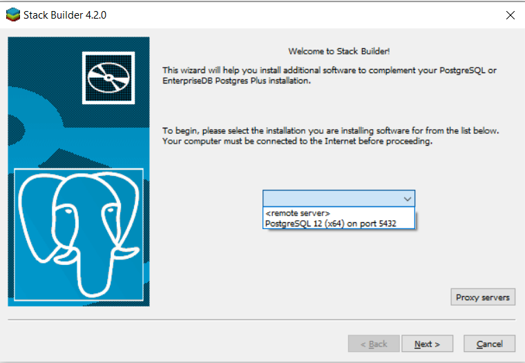
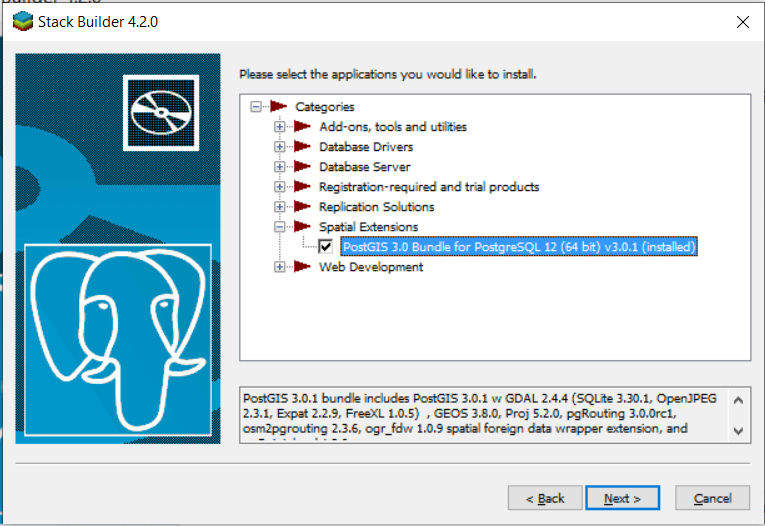

# Quarantined help [Backend]

Backend for a wishful quarantine people helper application that would be out soon.
Fighting #COVID-19 one step at a time. My wish for this project:

1. Lookup people who are ready to help you out when you are quarantined. For buying groceries etc.
2. Register yourself as someone who can do these errands.
3. A map view with markers and other stuff making it easy for people to access.

## First looks

API documentation: https://quarantined-help.github.io/quarantined-api-docs/

Collaborate at: [slack](https://join.slack.com/t/quarantinedhelp/shared_invite/zt-d0259x7q-BiC_viQhLRoQqqc5j~P0uw)

## Dependencies

We use `python 3.7.5` for development. Make sure you have this installed on
your machine, or use `pyenv` as described later in this documentation.

## Steps for local development

1. [Mac](#mac-installation)
2. [Windows](#windows-installation)

<h4 id="mac-installation">Instructions for Mac</h4>

1. Install pyenv and its virtualenv manager using
   ```
   $ brew install pyenv
   $ brew install pyenv-virtualenv
   $ pyenv install 3.7.5
   $ eval "$(pyenv init -)"
   quarantined_backend/$ pyenv virtualenv 3.7.5 env-3.7.5
   ```
   This will create a pyenv-virtualenv for you and probably place it on your
   `~/home/<username>/.pyenv/versions/`. You can activate that manually using
   ```
   quarantined_backend/$ source ~/.pyenv/versions/env-3.7.5/bin/activate
   ```
   or even better:
   ```
   quarantined_backend/$ pyenv activate env-3.7.5
   ```
   or, there are better ways to do this if you follow https://github
   .com/pyenv/pyenv-virtualenv
2. Now you are in the right environment, install dependencies using:
   ```
   (env-3.7.5) quarantined_backend/$ pip install -r requirements.txt
   ```
3. Install `postgis` using `brew install postgis`
4. We use `pre-commit` hooks to format code. See that you install it using
   https://pre-commit.com/. Later, install our pre-commit hooks using
   `(env-3.7.5) quarantined_backend/$ pre-commit install`
5. There are some `localsettings` you need to have as part of running the
   server. You can copy a template using:
   `(env-3.7.5) quarantined_backend/$ cp quarantined_backend/local_settings_sample.py quarantined_backend/local_settings.py`
   You need to modify the values there to use the applicaiton in full.
6. Run the Django standard runserver steps:
   ```
   (env-3.7.5) quarantined_backend/$ python manage.py migrate
   (env-3.7.5) quarantined_backend/$ python manage.py collectstatic
   (env-3.7.5) quarantined_backend/$ python manage.py runserver
   ```
   or even better, run it from pyCharm using your debugger.

<h4 id="windows-installation">Instructions for Windows</h4>

1. Fork and clone the repo:

   After forking this repo, do

   ```
   $ git clone git@github.com:<your-username>/quarantined_backend.git
   $ cd quarantined_backend
   quarantined_backend/$
   ```

2. Create a new environment using **venv** and activate it:

   ```
   quarantined_backend/$ python -m venv env-3.7.5 python=3.7.5
   (env-3.7.5) quarantined_backend/$ env-3.7.5/Scripts/activate
   ```

   - You will see a folder named **env-3.7.5** created

   - Here, _env-3.7.5_ is the environment name and we need the environment to run Python 3.7.5

3. Now you are in the right environment, install the dependencies using:

   ```
   (env-3.7.5) quarantined_backend/$ pip install -r requirements.txt
   ```

4. Install PostGIS - [Reference](https://www.gpsfiledepot.com/tutorials/installing-and-setting-up-postgresql-with-postgis/)

   1. Go to [PostgreSQL windows downloads](https://www.postgresql.org/download/windows)

   2. Download the installer from Enterprise DB

   3. Click windows on the EnterpriseDB page and download the appropriate version for your computer (64bit or 32bit)

   4. Run the .exe that has been downloaded to install PostgreSQL

   5. The default settings should be good. When prompted enter a password that you can remember

   6. PostgreSQL's Application Stack Builder will open after finishing the installation

   7. Select **PostgreSQL** from the dropdown and click next
      <!--  -->
      <p>
      
      </p>

   8. Under "Spatial Extensions" check the most recent version of PostGIS
      <!--  -->
      <p>
         
      </p>

   9. Use default options and after the download finishes click next to start installing

   10. Make sure "create spatial database" is checked and change the database name to **postgis**

5. We use pre-commit hooks to format code. See that you install it using https://pre-commit.com/. Later, install our pre-commit hooks using

   ```
   (env-3.7.5) quarantined_backend/$ pre-commit install
   ```

6. There are some **localsettings** you need to have as part of running the server.

   You can copy a template using:

   ```
   (env-3.7.5) quarantined_backend/$ cp quarantined_backend/local_settings_sample.py quarantined_backend/local_settings.py
   ```

   You need to modify the values there to use the application in full

7. Run the Django standard runserver steps:
   ```
   (env-3.7.5) quarantined_backend/$ python manage.py migrate
   (env-3.7.5) quarantined_backend/$ python manage.py collectstatic
   (env-3.7.5) quarantined_backend/$ python manage.py runserver
   ```
   or even better, run it from pyCharm using your debugger

## FAQ

1. Getting this error when running `python manage.py migrate` on Windows

   django.core.exceptions.ImproperlyConfigured: Could not find the GDAL library (tried "gdal204", "gdal203", "gdal202", "gdal201", "gdal20"). Is GDAL installed? If it is, try setting GDAL_LIBRARY_PATH in your settings.

   1. Install GDAL via OSGeo4W - https://stackoverflow.com/a/49159195/9734484

   2. If you are still getting the same error after executing `python manage.py migrate` add gdal version present in `C:/OSGeo4W/bin` to libgdal.py file shown in the error stack, for instance, if gdal300.dll is present add "gdal300" to the list, `lib_names` under os=="nt" for Windows

2. Getting this error when running `python manage.py migrate` on Windows

   psycopg2.OperationalError: could not translate host name "DATABASE_HOST" to address: Unknown host

   Update **quarantined_backend/local_settings.py** file. Default configuration is:

   - NAME - postgis
   - USER - postgres
   - PASSWORD - PostgreSQL password set during installation
   - HOST - localhost
   - PORT - 5432
